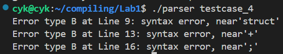
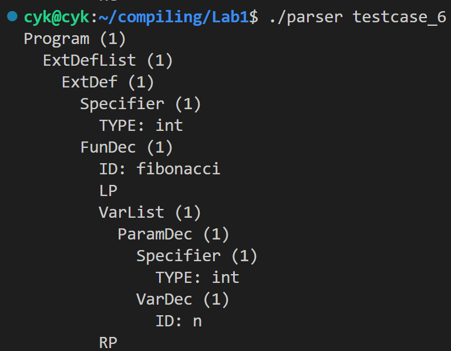

## Lab1 report
### <center> 曹熠坤 2022110790
### 1. 程序功能
- `lexical.l`用于将输入程序解析成`token`并直接输出
- `main.c`用于调用`yylex()`进行词法分析。
- `scanner`为词法分析器。
- `lexical2.l`用于将词法分析结果返回给`syntax.y`，以便其进行语法分析。
- `syntax.y`文件基于给定的文法生成式对`token`进行自底向上规约，并创建语法树。
- `main2.c`文件，调用`yyparse()`进行语法分析，并调用`treenode.h`中的`dfs()`函数对语法树进行输出。
- `parser`为语法分析器。
### 2. 实验结果
#### 2.1 错误输出
以给定的[testcase_4](./code/testcase_4)为例：
`./parser testcase_4`输出：

<center>
    
    <br>
    <div style="color:orange; border-bottom: 1px solid #d9d9d9;
    display: inline-block;
    color: #999;
    padding: 2px;">
    </div>
</center>

`testcase_4`中，在if语句后进行了结构体变量f的声明，不符合我们的规定`CompSt -> LC DefList StmtList RC`；`f++`不符合任何一个`Exp`的定义；`while()`括号中多打了一个分号，均正确报错。
#### 2.2 语法树构建
以[testcase_6](./code/testcase_6)为例:
`./parser testcase_6`输出（篇幅原因未截全）：

<center>
    
    <br>
    <div style="color:orange; border-bottom: 1px solid #d9d9d9;
    display: inline-block;
    color: #999;
    padding: 2px;">
    </div>
</center>

观察输出可知，语法树的结构正确，并且按照节点所在层数输出对应个数的空格，对于`ID ,TYPE,INT,FLOAT`等终结符，均能够输出其内容。
### 3. 编译方法
在`./code`目录下有`makefile`文件，只需在`linux`环境下在该目录中运行指令即可自动编译，支持的指令如下：
```bash
make clean #清除parser以及所有编译生成的中间文件
make       #编译生成语法分析器parser
make debug #生成具有调试功能（显示状态机）的语法分析器parser
```
### 4. 程序要点
#### 4.1 数据结构
为了处理可变子节点数的树型结构，我采用了以下的数据结构作为树的每一个节点：
```C
//treenode.h
struct Parsetree
{
	int line; //当前节点所在行号
	char *Token; //当前节点Token内容
	int isleaf; //是否是叶子节点
	union //标识符内容/整数值/浮点数值
	{
		char* Id_Type;
		int intval;
		float floatval;
	};
	struct Parsetree *firstchild,*nxxtbro;//指向第一个子节点和下一个兄弟节点的指针
};
typedef struct Parsetree* Treenode;
```
在此基础上，还需实现可变个数的参数传递，以对拥有不同个数子节点的非终结符进行处理：
```C
//treenode.h
static Treenode newnode(int line,char *TOKEN,int amount,...)
```
在该函数中，需要用到`va_list`数据结构对可变参数部分进行处理，并调用`va_arg()`函数以`Treenode`的形式返回下一个参数。
```C
//...
va_list list;
va_start(list,amount);
ch=va_arg(list,Treenode);
rt->firstchild=ch;
if (amount!=1)
{
	for (int i=1;i<=amount-1;i++)
	{
		ch->nxxtbro=va_arg(list,Treenode);
		ch=ch->nxxtbro;
	}
	ch->nxxtbro = NULL;
}
va_end(list);
//...
```
#### 4.2 空的语法成分处理
定义为空的产生式执行的动作为创建空节点`EmptyNode()`，但是需要与`NULL`区别开，否则在输出到这个节点时会触发递归边界条件直接结束，我采取的办法是将其`Token`字段设置为`"EMPTY"`。在`dfs()`输出时判断一下当前节点的`Token`是否为`"EMPTY"`，不是的话则按要求输出，是的话直接跳过。
#### 4.3 八进制数，十六进制数，浮点数的处理
在`lexical.l`中添加正则表达式对这三者进行识别：
```
HEX 0[xX][0-9a-fA-F]+
DEC 0|([1-9][0-9]*)
OCT 0[0-7]+
INT {HEX}|{DEC}|{OCT}

digits [0-9]+
FLOAT {digits}\.{digits}|(\.{digits}|{digits}\.|{digits}\.{digits}|{digits})([eE][+-]?{digits})
```
在创建节点时，调用`strtol()`和`atof()`函数进行转化得到其数值。
#### 4.4 注释处理
在`lexical.l`加入对`"//"`和`"/*"`的定义：
- 遇到`"//"`后一直`input()`直到读入换行符
- 遇到`"/*"`后一直`input()`直到读入连续的`"*/"`或`'\0'`，如果读到`'\0'`，说明缺少`"*/"`，打印报错信息，并设置全局变量`hasFault = 1`后返回。