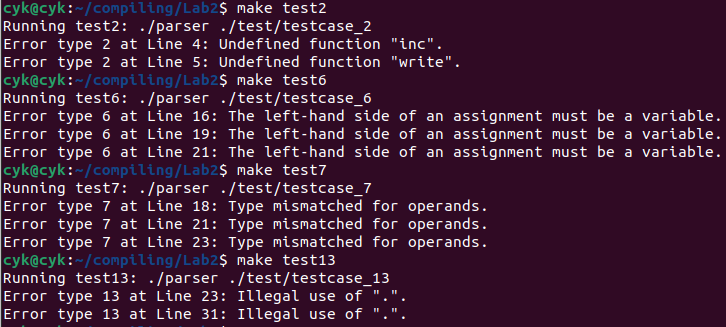

## Lab2 report
### <center> 曹熠坤 2022110790
### 1. 程序功能
本次实验在实验一构建的语法树的基础上，完成了所有必做内容，即对于没有词法错误和语法错误的程序进行语义分析，并输出所规定的`17`种语义错误类型。
### 2. 实验结果
对于给定的测试用例进行测试，输出的结果如下：
<center>
    
    <br>
    <div style="color:orange; border-bottom: 1px solid #d9d9d9;
    display: inline-block;
    color: #999;
    padding: 2px;">
    </div>
</center>

结果分析：
- testcase_2: 出现了未定义的函数`inc()`和`write()`
- testcase_6: 赋值号`=`的左值只能为标识符、数组元素和结构体字段三者之一，这里出现了常量、二值运算表达式和函数调用三种不合法的左值
- testcase_7: 运算符两侧的操作数类型不匹配
- testcase_13: 对非结构体变量使用了`.`运算符

综上，结果输出正确。

### 3. 编译方法
在`./code`目录下有`Makefile`文件，只需在`linux`环境下在该目录中运行指令即可自动编译，支持的指令如下：
```bash
make clean #清除parser以及所有编译生成的中间文件
make       #编译生成目标文件parser
make gdb   #自动在所有的编译指令加上-g选项，生成支持gdb调试功能的目标文件parser
make testx #自动运行parser分析./test目录下的testcase_x
```
### 4. 数据结构
在实验一所使用的语法树节点`node`的基础上，还实现了如下数据结构（详见`./code/semantic.h`）：
- 用于描述变量、函数、结构体类型信息的结构体`type`
- 用于描述结构体的域或函数参数表的结构体`fieldlist`
- 符号表项`tableItem`
- 用于查找符号的哈希表`hashTable`
- 用于管理作用域的栈`stack`
- 符号表`table` 
### 5. 典型错误的处理方法
下面讲解一下测试结果中所涉及到的错误类型的检测方法：
#### Error type 2: Undefined function
当我们检测到函数调用时（即当前节点为`Exp -> ID LP Args RP | ID LP RP`），我们根据`ID`节点的值（即函数名）调用`searchTableItem()`函数查找符号表，如果没有找到，就报错函数未定义。`t`为`Exp`的第一个子节点，后同。
```C
// in function Exp()
else if (!strcmp(t->name, "ID") && t->next) { //函数调用
        pItem funcInfo = searchTableItem(table, t->val); //根据函数名查找符号表
        // function not find
        if (funcInfo == NULL) { //函数未定义
            char msg[100] = {0};
            sprintf(msg, "Undefined function \"%s\".", t->val);
            pError(UNDEF_FUNC, node->lineNo, msg);
            return NULL;
        } 
        ...
    }
```
#### Error type 6: The left-hand side of an assignment must be a variable
我们首先通过检测`t`的`name`字段和`t->next`的`name`字段判断出当前语法结构为赋值语句，然后对左值进行检查。注意，函数调用（`Exp -> ID LP Args RP | ID LP RP`）也满足`tchild->name`为`ID`，需要再对`tchild`的下一个兄弟节点是否为`LP`进行检查，并且还要判断`tchild->next`是否为空指针以防止`Segmentation Fault`的出现。
```C
// in function Exp()
if (!strcmp(t->name, "Exp")) {
        if (strcmp(t->next->name, "LB") && strcmp(t->next->name, "DOT")) { //不是数组，也不是结构体访问
            // ...    
            // Exp -> Exp ASSIGNOP Exp
            if (!strcmp(t->next->name, "ASSIGNOP")) { //赋值运算符
                //检查左值
                pNode tchild = t->child;
                if( (!strcmp(tchild->name, "ID") &&
                           (!tchild->next || strcmp(tchild->next->name, "LP")))|| //不能是函数调用
                           !strcmp(tchild->next->name, "LB") ||
                           !strcmp(tchild->next->name, "DOT")) { //允许的左值
                    // check match or not
                } else {
                    //报错，左值
                    pError(LEFT_VAR_ASSIGN, t->lineNo,
                           "The left-hand side of an assignment must be "
                           "a variable.");
                }
            }
// ...
```
#### Error type 7: Type mismatched for operands
与上述方法类似，在`Exp()`函数中，检查到`Exp->Exp OP Exp`时，我们递归调用`Exp()`函数获取两个`Exp`子节点的类型，并调用`checkType()`函数检查二者是否匹配，若不匹配，则报错运算符两侧类型不必配。

#### Error type 13: Illegal use of "."
通过前面的一系列检查，定位到`Exp -> Exp DOT ID`，调用`Exp()`获取第一个子节点类型，并检查其`kind`字段是否为`STRUCTURE`，若不是，则报错。
```C
//in function Exp()
if (!strcmp(t->name, "Exp")) {
    // 基本数学运算符
    if (strcmp(t->next->name, "LB") && strcmp(t->next->name, "DOT")) {
    //...
    }
    else {
        if (!strcmp(t->next->name, "LB")) {
        // ...
        }
        // Exp -> Exp DOT ID
        else {
            pType p1 = Exp(t);
            pType returnType = NULL;
            if (!p1 || p1->kind != STRUCTURE ||
                !p1->u.structure.structName) {
                //报错，对非结构体使用.运算符
                pError(ILLEGAL_USE_DOT, t->lineNo, "Illegal use of \".\".");
                if (p1) deleteType(p1);
        }
// ...
```
