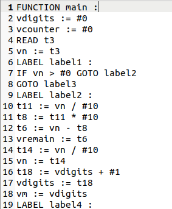
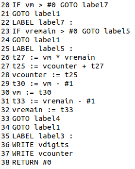
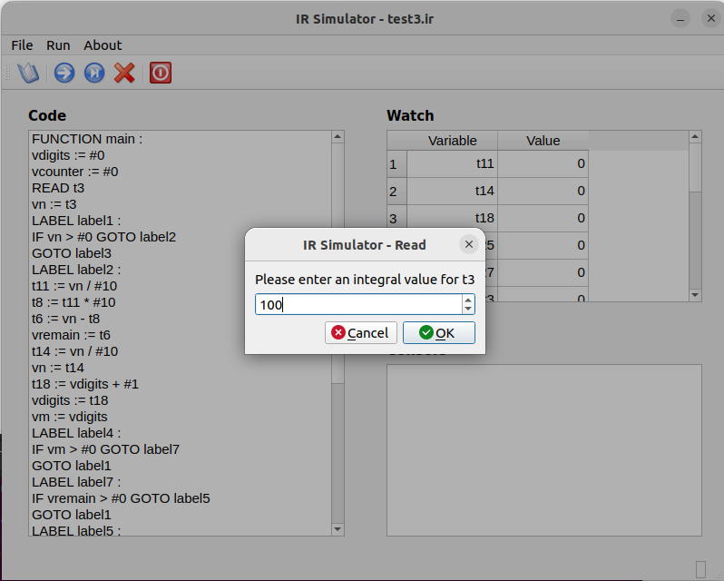
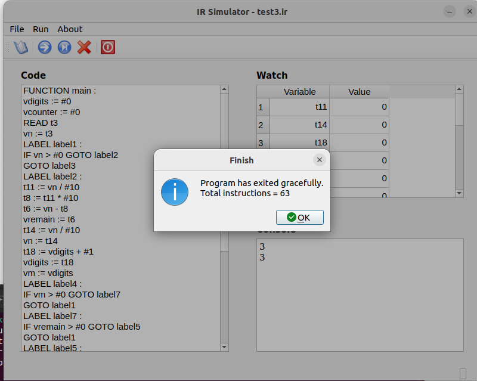
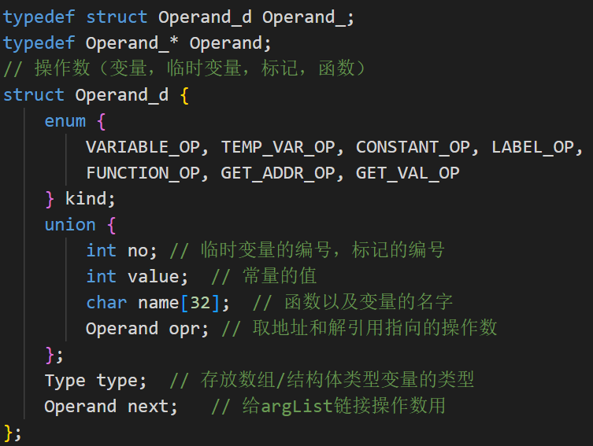
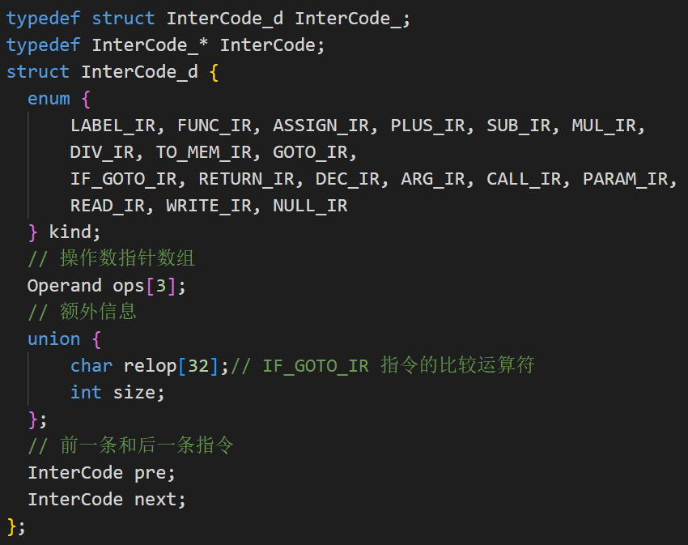
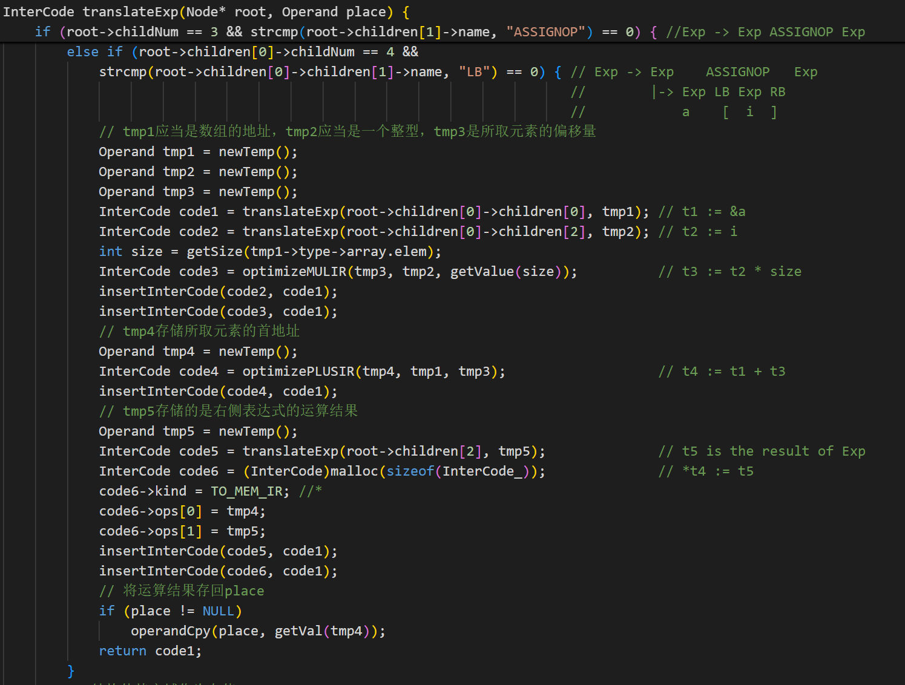

## Lab3 report
### <center> 曹熠坤 2022110790
### 1. 程序功能
根据之前实验的词法分析和语法分析我们已经构造除了语法树和符号表，此基础上我们对此语法树的节点自上而下地进行递归调用，对每个语法成分进行翻译，并向最终结果中添加这个语法成分所对应的中间代码。本次完成了必做和选做的全部内容。
### 2. 实验结果
下面以给定的`testcase_3`为例演示实验结果：
首先在实验目录中运行`./parser testcase_3 test3.ir`生成中间代码。生成的中间代码如下图：
<p align="center">
  
  
</p>

接着`cd irsim`切换到虚拟机的目录，执行`python3.8 irsim.pyc`激活小程序，然后加载`test3.ir`，点击运行，输入`100`，下面是程序的运行结果。
<p align="center">
  
  
</p>

### 3. 编译方法
在`./code`目录下有`Makefile`文件，只需在`linux`环境下在该目录中运行指令即可自动编译，支持的指令如下：
```bash
make clean #清除parser以及所有编译生成的中间文件
make       #编译生成目标文件parser
make gdb   #自动在所有的编译指令加上-g选项，生成支持gdb调试功能的目标文件parser
```
### 4. 数据结构
在实验一和实验二的基础上，为表示和存储中间代码，还需新增如下数据结构：
- 1. 用于表示操作数类型的结构体`Operand_`及其指针`Operand`
<p align="center">
  
</p>

- 2. 用于表示中间代码结构的双向链表节点`Intercode`
<p align="center">
  
</p>

### 5. 翻译过程
进行中间代码生成时，自顶向下递归调用每一个语法结构的翻译函数。在每个翻译函数中，我们需要依据该语法结构对应的产生式对其进行解析，视具体情况，或通过递归调用其子过程的翻译函数生成中间代码并用临时变量保存其结果，或新建中间代码节点并为其各个字段填充内容，最后调用`insertInterCode()`函数逐步将生成的代码合并到一起。
下面以表达式翻译函数`translaterExp()`中的一个分支（数组元素的赋值）为例进行讲解：
<p align="center">
  
</p>

进入该分支的条件即为：该`Exp`节点为赋值语句且其左值为数组引用。我们知道，数组元素赋值的关键是应计算该数组元素对应的地址。首先我们递归调用自身获得数组名对应的地址并存储到中间变量`tmp1`中，然后依然调用自身解析中括号中的`Exp`并将其值存储到`tmp2`中。为了确定偏移量(`tmp3`)，我们需要调用`getSize`函数获取`tmp1`所对应的数组的宽度，并生成一条乘法指令计算下标*宽度的值。该数组元素的地址(`tmp4`)即为基地址`tmp1`+偏移量`tmp3`，为此需要生成一条加法指令`tmp4 := tmp1 + tmp3`。我们还需将赋值号右侧的表达式进行处理并将其值存入`tmp5`，然后生成一条语句`*tmp4 = tmp5`向数组元素的地址中填入表达式的值。
在此过程中，可以注意到，每生成一条新的指令，都会调用`insertInterCode()`将其追加到`code1`后，这样这个数组元素赋值对应的`Exp`节点所对应的中间代码就全部被存储到双向链表`code1`中，最后将它返回给上层过程即可。
### 6. 实验总结
中间代码作为编译器前后端的桥梁，其结构设计直接影响优化质量和目标代码生成效率。通过本次实验，我对于中间代码的生成过程与实现方法有了进一步的认识，并且在小程序执行中间代码的过程中深化了对其的理解，并体会到了中间代码在编译系统中桥梁的作用。
