# 2025春编译原理 - cyk
## 材料说明
- 本文：学习方法和试题回忆
- lab：能通过zqf老师当堂给的测试用例
- lec：2025年zqf老师的课件
- 题册和答案：见下文
- 期末题：网上找的期末题：建议课刷完，题册写完有时间再做
- 课程复习资料：网上找的笔记和选择题答案等
- 24春_编译原理：cyh学长的火炬
- 编译原理郭庆吉：gqj学姐的火炬
- 特别感谢lfd学长、cyh学长和gqj学姐
## 笔者成绩：86.8 
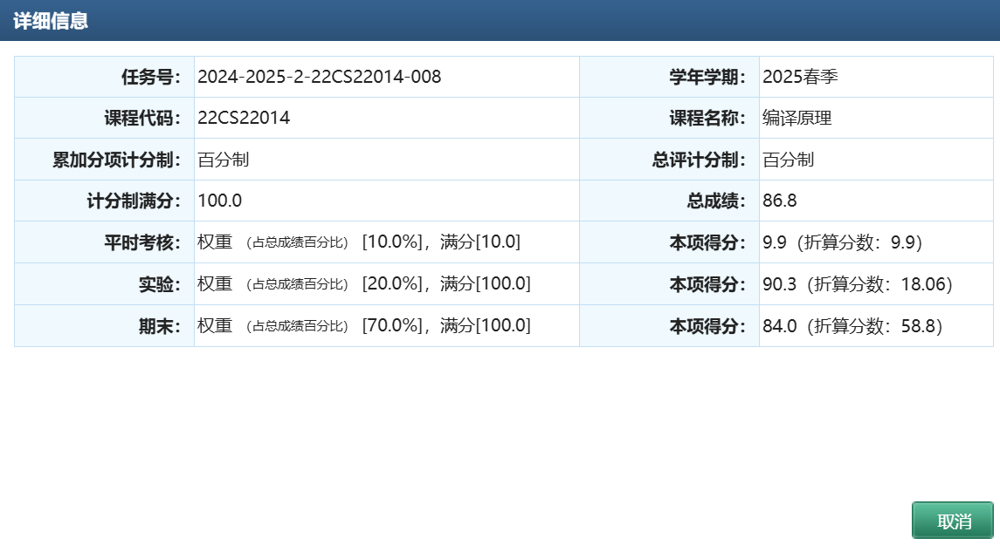
教学班排名：8
## 学习方法：
- 刷mooc，关注课件中的例题
- 做[题册](./《编译系统》习题（带红色星号的为选做）.pdf)，答案：[答案1](./《编译系统》习题答案-学长版.pptx) [答案2](./编译原理郭庆吉/编译原理期末/《编译系统》习题--室友手写%20(1).pdf)
  - 题册中带星号的不用管
  - 类似这种非标准的sdt也不用耽误太多时间
  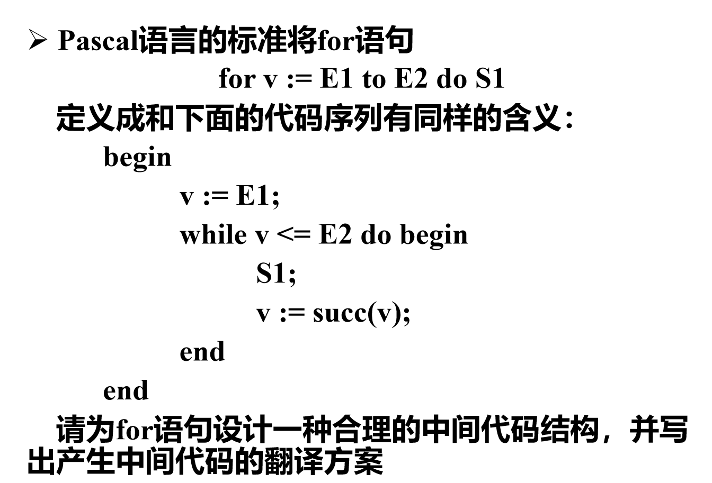
## 实验
难度大，代码量很大，自己完成不太现实。如果改的不多的话直接用我的吧，查重和验收都不是很严。
## 考试回忆：
题量超级大，我最后一题只答了不到一半，下面是能回忆起来的题
### 选择
就记得一道，如果一个文法是（）文法，他就一定是LR(1)文法
A、LR(0) B、SLR(1) C、LALR(1) D、以上全不对
当时没说是单选，这四个文法是包含关系，我写的ABC，不知道对错，因为比较怪所以记下来了
其余跟spoc上选择题关系密切，把spoc习题做一下再考试
### 填空（顺序忘了，可能漏了一题）
1. 下图，给全文，把过程和活动记录挖空
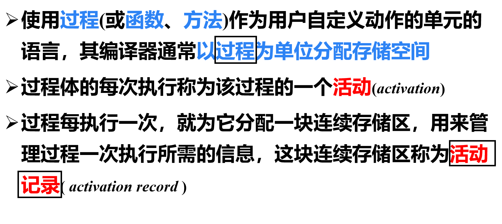
2. 下图，类似全文，填堆和栈
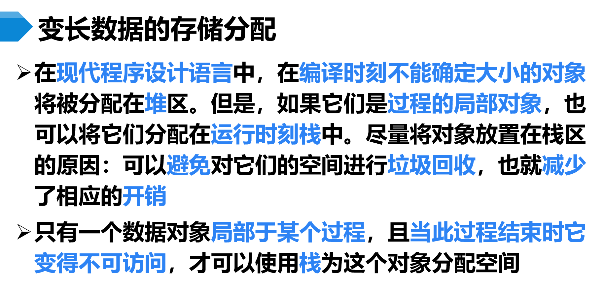
3. 下图，问寄存器描述符和地址描述符定义
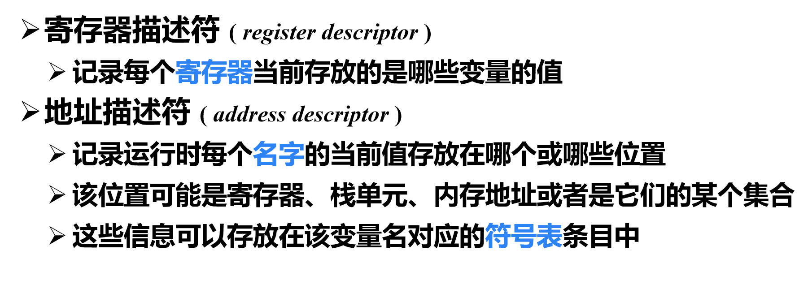
4. 原理类似下图，给出假设：指令中每一个操作数或一个操作码占四字节（言外之意其余0(SP)这种不占），给了m和q活动记录的长度、二者代码区的开始位置，还给了表格中call的三条栈式目标代码，让你把里面的标签替换成具体的绝对地址（类似右图这种立即数的形式）。
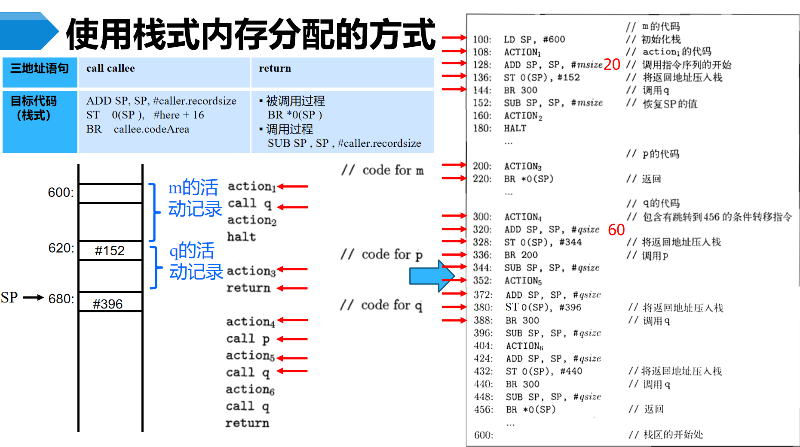
### 大题
#### 1. 词法分析
- 设计token序列（原理类似下图）
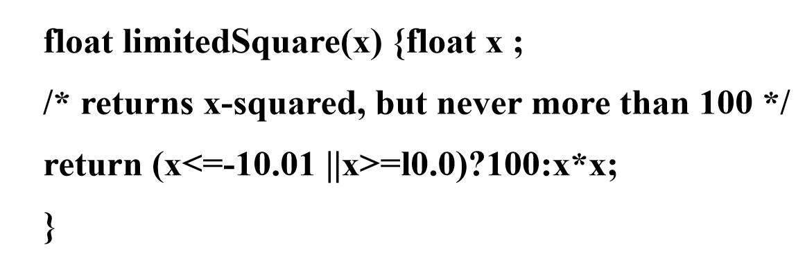
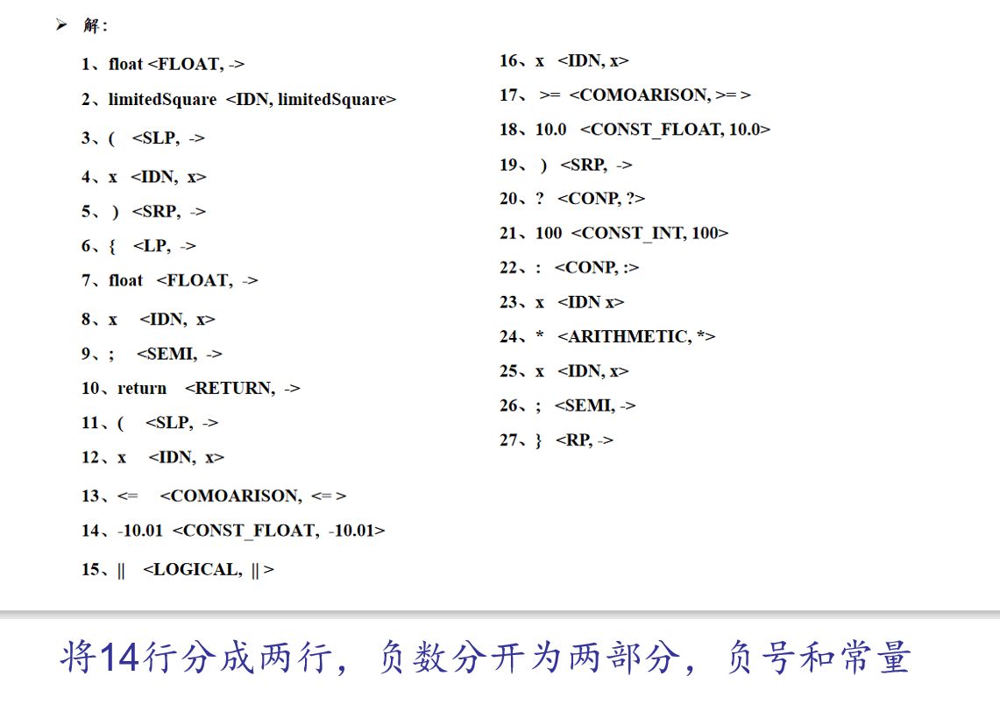
- 写单词的正则表达式，画它的DFA（以字母或下划线开头，然后是若干字母或数字）
    但是没弄清楚“若干”包不包括零个，我写的：
    ```
    letter -> a|b|...|z|A|B|...|Z
    digit -> 0|1|...|9
    word -> (_|letter)(letter|digit)*
    ```
    自动机就很好画了。
#### 2. 语法分析
- 很常规，给一个文法，证明是LR(1)文法但不是LALR(1)文法
增广文法，画LR(1)自动机，找同心项集，举例说明合并后有规约-规约冲突即可
- 还要证明改造后的文法不是LL(1)文法
提左公因子，消除左递归，FIRST集，FOLLOW集，SELECT集，说明同一左部的产生式的SELECT集有相交
#### 3. 语法制导翻译
原题（强调了是S-SDD）
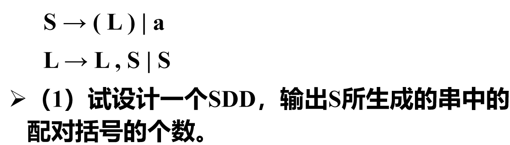
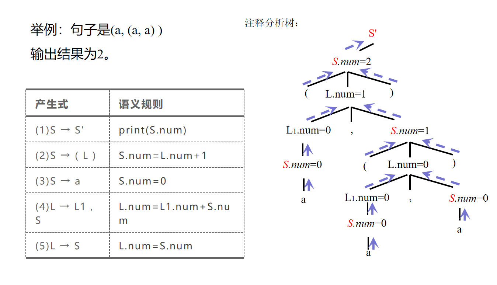
还要写成栈的操作，注意是规约时执行语义动作就好了
注意：文法需要增广，上图(1)应该是S' -> S，这是为了输出根节点S的配对括号数，还是文字游戏，“配对括号数”一左一右算一个还是两个，我写的两个，估计都算对
#### 4. 运行存储分配
- 画控制栈，画访问链和控制链
  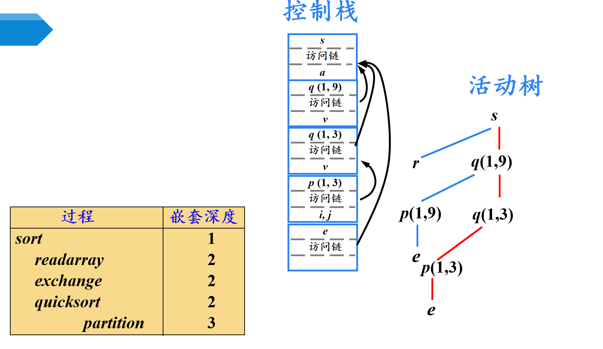
  在上图的基础上每个活动记录的访问链上面加一条控制链，指向其调用者（上方紧邻）的局部数据开始处
- 相同的情形，画display表
  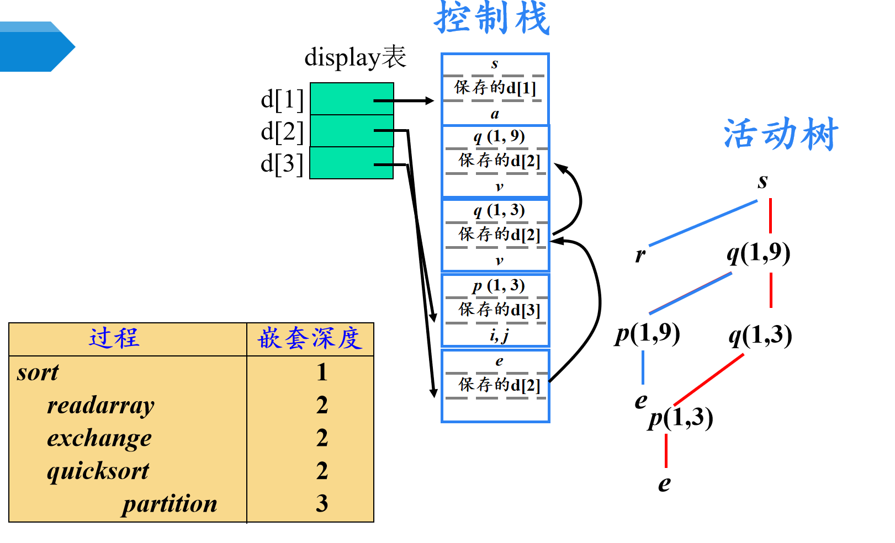
#### 5. 中间代码生成
- 回填的SDT，给你产生式和框图，让你填几条代码（应该是这个，要不就是S -> while B do S1）
  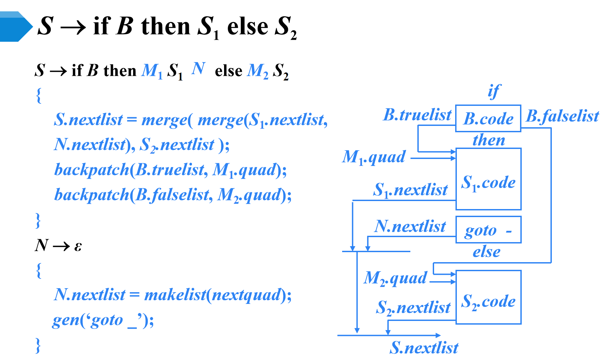
- 给语句，给注释分析树，已知开始的语句编号100，让你填所有的list和quad，**注意：没给上面的SDT**
  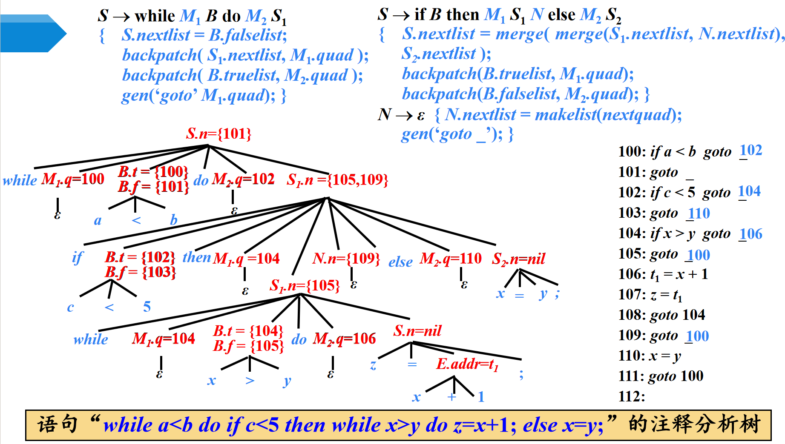
  策略是草纸上硬写中间代码，然后根据各种list的定义（跳转到某处的语句集合）填空。
#### 6. 代码优化
- 给中间代码，划分基本块，画流图
- 根据流图写出自然循环
- 写出所有基本块的def和use集合，写出各基本块出口处的活跃变量信息
- （记不清了，毕竟没写到这里）